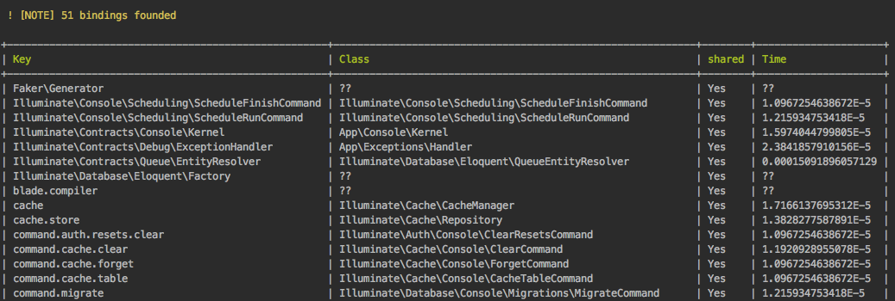

# Debug Container - Laravel

You can find out what services are registered with the container using the console. 

## Show all services

```bash
php artisan debug:container
```

## Install in your project

### Run composer

```bash
composer require bernardosecades/laravel-debug-container
```

### Add DebugContainerServiceProvider in bootstrap/app.php

Example:

```php
if ( env('APP_ENV') === 'development' ) {
    $app->register(\BernardoSecades\Laravel\DebugContainer\DebugContainerServiceProvider::class);
}
```

# Screenshots

```bash
php artisan debug:container
```



# Tests

```bash
./vendor/bin/phpunit
```


